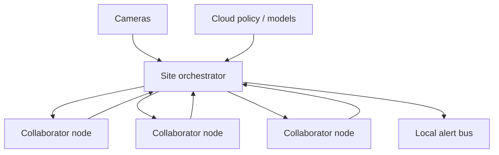

# ChoirEdge

**Source:** `ai-in-iot/1802.02138v3/`
**Domain:** `ai-iot`
**One-liner:** A collaborative inference orchestrator that shards live vision DNNs across the cameras and Pi-class hubs already on a LAN, so homes and venues get real-time recognition without shipping video to the cloud or buying a GPU appliance.
**Wedge:** Multi-camera smart homes, retail backrooms, and small venues that need action/image recognition now, but refuse cloud video upload for privacy and cannot justify Tegra-class servers per site.
**Positioning:** Dynamic model-parallel edge choirs. Pruning and quantization still leave heavy DNNs too large for one Raspberry Pi; ChoirEdge harvests aggregated LAN compute, re-partitions when devices join/leave, and matches or beats a TX2 on action recognition performance at similar energy in the paper’s evaluations.

## Market research synthesis

### Thesis from source

IoT sensor abundance drives real-time speech/image/video recognition demand. The default pattern — offload DNNs to the cloud — increases network load, cost, and privacy risk; a powerful in-home server is expensive and expands the attack surface. Individual resource-constrained IoT devices are too weak for state-of-the-art recognition even after pruning, quantization, or binarization.

Musical Chair proposes collaborative inference: devices on the same IoT network pool CPU to run DNN recognition locally using data and model parallelism, adapting at runtime as devices appear or disappear (“musical chairs”). Demonstration on up to 12 Raspberry Pis with cameras runs a 15-layer action-recognition model plus image-recognition models. Versus a Tegra TX2 (six-core CPU + GPU), the distributed action-recognition system achieved similar energy consumption and about 2× the performance; image recognition showed similar performance with dynamic energy savings. Architecture diagrams contrast external server, in-home server, and Musical Chair privacy domains — the choir keeps recognition inside the secure local domain and can alert the user without cloud video exfiltration.

The product is the orchestration control plane and runtime: membership, graph partition, live rebalancing, privacy-preserving local alerts, and workload profiles for action and image models.

### Buyer & economic model

- **Primary buyer:** Head of Smart Venue / Home IoT platform product, or retail loss-prevention systems buyer seeking on-prem vision.
- **Users:** site installers, edge ML engineers, privacy officers, facility operators receiving alerts.
- **Budget owner / value metric:** security/IT budget for on-prem vision. Value metric is cloud video egress avoided, recognition FPS vs single-device baseline, and energy per inference at site.
- **Competing status quo:** cloud vision APIs, NVR+GPU appliances, or degraded single-board models with poor accuracy.

### Domain constraints

- **Regulatory / trust / safety:** local processing helps privacy but still requires consent and retention limits for alerts/clips; collaborative nodes must authenticate to each other to avoid rogue joiners.
- **Data sensitivity:** camera frames stay on LAN; only alerts/events should leave by default.
- **Change-management realities:** device churn (someone unplugs a Pi) must not brick recognition; graceful degradation required.

## Business requirements

- BR-1: Recognition for supported vision models must complete on the local network without mandatory cloud offload of raw frames.
- BR-2: The orchestrator must re-partition model/data parallel graphs when member devices join, leave, or fail, within a stated rebalance SLA.
- BR-3: Site performance must meet published FPS/latency targets relative to a defined appliance baseline for the chosen model profile.
- BR-4: Energy per inference at the site must be measurable and comparable to appliance alternatives for procurement decisions.
- BR-5: Membership must be authenticated and allowlisted — arbitrary LAN devices cannot join the choir.
- BR-6: Privacy policy must default to local-only frames, with explicit consent for any clip upload.
- BR-7: Workload profiles (action recognition, image recognition, future models) must declare minimum choir size and memory budgets.
- BR-8: Operators must receive alerts when the choir falls below safe membership and recognition is degraded.
- BR-9: Partial results and stragglers must be handled so one slow Pi cannot stall the entire pipeline unbounded.
- BR-10: Audit logs must record membership changes and model versions used for each alert for incident review.
- BR-11: Multi-site estates need centralized policy with per-site local execution — no forced central video hub.
- BR-12: Commercial packaging must price by camera and collaborator-node seats, not by cloud API calls.

## User stories

Canonical user stories live in sibling [USER_STORIES.md](USER_STORIES.md).

## System design

### Overview

ChoirEdge runs a site orchestrator plus node runtimes. Cameras produce frames; the orchestrator assigns data shards and model partitions across authenticated collaborator nodes; nodes exchange intermediate activations on the LAN; the orchestra assembles recognition results and emits local alerts. When membership changes, the orchestrator recomputes partitions and migrates live work. Optional cloud components handle license, model-profile distribution, and multi-site policy — not video.

### Actors & boundaries

- **Actors:** cameras, collaborator nodes, site orchestrator, facility operators, ML engineers, privacy officers.
- **Trust boundary:** frames and activations stay inside the site security domain; cloud receives metrics and signed alerts only if configured.
- **Human-in-the-loop points:** membership allowlisting, alert response, model-profile promotion.

### Core capabilities

1. **Authenticated membership** — allowlisted choir nodes with attestation.
2. **Model profile registry** — action/image graphs with resource needs.
3. **Dynamic partitioner** — model and data parallelism under churn.
4. **LAN activation fabric** — intermediate tensor exchange.
5. **Result assembly and alerting** — local events without frame egress.
6. **Degraded-mode control** — minimum quorum and operator signaling.
7. **Performance and energy telemetry** — FPS, joules, stragglers.
8. **Multi-site policy** — central config, local execution.

### Conceptual data

- **Primary entities:** Site, Camera, CollaboratorNode, ModelProfile, PartitionPlan, InferenceJob, AlertEvent, MembershipEvent, TelemetrySample.
- **Critical events:** node joined/left, partition recomputed, inference completed, alert emitted, quorum lost, profile updated.
- **Retention / audit needs:** alerts and membership audits retained per policy; frames retained only in explicit local clip buffers with TTL.

### Integrations (conceptual)

- **Systems of record:** site VMS/NVR (optional clip handoff), identity for operators, license service.
- **Upstream signals:** camera frames, node heartbeats, power meters (optional).
- **Downstream actions:** local push/SMS alerts, webhook to incident tools, procurement reports.

### High-level architecture

### Success metrics

- **Leading:** rebalance time after node loss; quorum uptime; LAN activation bytes per inference.
- **Lagging:** FPS vs TX2 baseline; energy per inference; cloud raw-video egress (target ~0); alert precision/recall for deployed profiles.

## OpenAPI skeleton

Canonical HTTP surface lives in sibling [openapi.yaml](openapi.yaml). Summary:

- **Base path:** `/v1/...`
- **Auth:** `X-API-Key` for nodes; Bearer JWT for operators.
- **Resource groups:** Sites, Nodes, ModelProfiles, PartitionPlans, InferenceJobs, Alerts, Telemetry.
