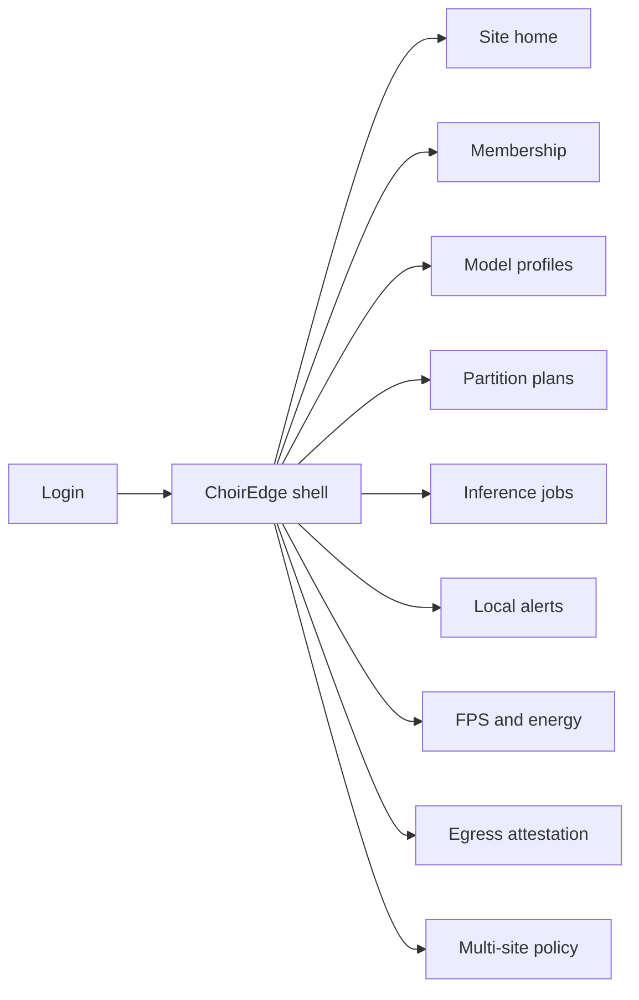
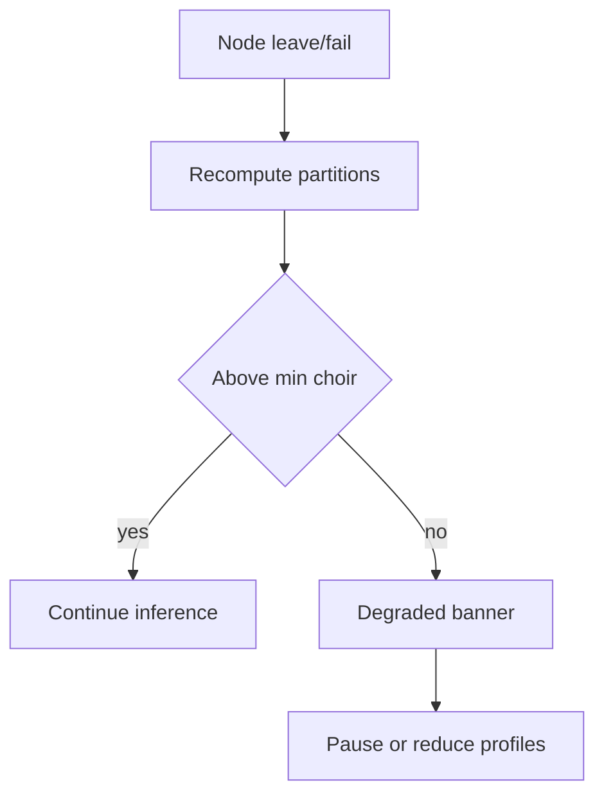

# ChoirEdge — Web app

**Product:** [PRODUCT.md](./PRODUCT.md)
**Primary surface:** Site choir orchestrator console (membership, partitions, alerts, energy/FPS)
**Secondary surfaces:** Multi-site policy cloud (models/licenses only — no video hub); privacy egress attestation view
**Design thesis:** ChoirEdge is a musical-chair of LAN collaborators — dynamic model-parallel inference that keeps frames in the building — not a cloud vision API console and not an NVR. The UI metaphor is a chamber ensemble score: warm walnut-on-ink stage, each authenticated Pi as a seated part, partition lines rebalancing when a chair empties, and a coral quorum banner when the choir is too thin to sing. Brand sits on alert and membership screens so operators know recognition stayed inside the local privacy domain.

## UX research synthesis

### Category peers (best-in-class)

- **Frigate / Home Assistant vision add-ons:** Local camera AI with privacy-forward defaults. Steal: local-only frames and clear degraded-mode when hardware missing; reject single-box GPU appliance as the only scale path.
- **NVIDIA Fleet Command / DeepStream multi-node:** Model deploy and per-node latency. Steal: partition/straggler metrics; reject datacenter-first UX that assumes Tegra per site.
- ** balena / Portainer fleet membership:** Device claim codes and authenticated join. Steal: allowlisted membership with QR claim; reject open LAN auto-join.
- **Verkada / Rhombus alert ops (patterns):** Facility alert queues without forcing cloud VMS as home. Steal: operator alert clarity; reject cloud raw-video as default evidence path.

### Patterns to adopt / reject

- **Adopt:** Authenticated choir membership; live re-partition on join/leave; quorum/degraded banners; local alerts with TTL clips; FPS and energy vs TX2 baseline; straggler handling; multi-site policy with local execution; zero raw-frame egress by default.
- **Reject:** Mandatory cloud video upload; unmanaged LAN join; silent stall on one slow Pi; purple “AI camera” marketing panels; dashboard that looks like a GPU cloud job board.

### Trust, density, and workflow constraints from PRODUCT.md

Frames stay on LAN; cloud is policy/models/metrics only (BR-1, BR-6, BR-11). Membership allowlisted and attested (BR-5). Rebalance within SLA when chairs move (BR-2). Quorum loss must alert operators (BR-8). Stragglers cannot stall unbounded (BR-9). Energy and FPS measurable for procurement vs appliance (BR-3, BR-4). Audit membership + model version per alert (BR-10).

## Information architecture

### Nav model

### Roles → default home

| Role | Default home | Why |
|------|--------------|-----|
| Facility operator | Local alerts + site home | On-prem action alerts; degraded banner (BR-8) |
| Edge ML engineer | Model profiles + partitions | Shard graphs; straggler metrics (BR-7, BR-9) |
| Installer | Membership | QR claim enroll; auto-rebalance (BR-2, BR-5) |
| Privacy officer | Egress attestation | Prove no raw frame egress (BR-6) |
| Platform admin | Multi-site policy | Pin versions; procurement telemetry (BR-11, BR-4) |

### Cross-links to OpenAPI resources

| Nav area | OpenAPI tags / resources |
|----------|---------------------------|
| Buildings / venues | Sites |
| Collaborator Pis / cameras | Nodes |
| Action/image graphs | ModelProfiles |
| Live shard maps | PartitionPlans |
| Pipeline runs | InferenceJobs |
| On-prem events | Alerts |
| FPS / joules / stragglers | Telemetry |

## Screen inventory

### Site home

- **Purpose:** Answer “is the choir quorate, and is recognition keeping up without cloud video?” in one composition.
- **Entry:** Site operator login.
- **Layout regions:** Brand + site; ensemble seating map (nodes as parts); quorum meter; FPS vs baseline; energy/inference; rebalance SLA chip; degraded banner slot.
- **Primary actions:** Open membership gap; open alerts; freeze model version.
- **Empty / loading / error:** Empty = claim first camera + collaborator; orchestrator down = coral.
- **BR / story ties:** BR-1, BR-3, BR-8.

### Membership

- **Purpose:** Allowlist and attest collaborator nodes — no arbitrary LAN joiners.
- **Entry:** Installer default.
- **Layout regions:** Member table (role camera/collaborator, attestation, heartbeats); claim/QR enroll; revoke.
- **Primary actions:** Enroll; revoke; trigger rebalance.
- **Empty / loading / error:** Unauthenticated attempt logged and denied.
- **BR / story ties:** BR-5; privacy officer attestation story.

### Model profiles

- **Purpose:** Publish action/image profiles with min choir size and memory budgets.
- **Entry:** ML engineer.
- **Layout regions:** Profile list; min members; partition hints; TX2 baseline reference.
- **Primary actions:** Publish; pin per site; retire.
- **Empty / loading / error:** Below min choir = cannot arm profile.
- **BR / story ties:** BR-7, BR-3.

### Partition plans

- **Purpose:** Show live model/data parallel assignment and rebalance after churn.
- **Entry:** From home or membership change.
- **Layout regions:** Layer/shard score view; migration progress; rebalance timer vs SLA.
- **Primary actions:** Force rebalance; pin shard (advanced); open straggler.
- **Empty / loading / error:** Rebalance timeout = amber with partial plan.
- **BR / story ties:** BR-2; installer upgrade story.

### Inference jobs / stragglers

- **Purpose:** Per-partition latency and queues so one slow Pi cannot stall unbounded.
- **Entry:** ML engineer diagnostics.
- **Layout regions:** Job table; partition latency bars; straggler policy (drop/partial/timeout).
- **Primary actions:** Adjust straggler policy; drain node.
- **Empty / loading / error:** Stall detected = coral with policy action taken.
- **BR / story ties:** BR-9.

### Local alerts

- **Purpose:** Facility-facing recognition events without shipping video offsite.
- **Entry:** Operator default.
- **Layout regions:** Alert queue; local clip TTL status; model version stamp; membership audit link.
- **Primary actions:** Ack; open local clip; export incident metadata.
- **Empty / loading / error:** Quorum lost = alerts paused with banner.
- **BR / story ties:** BR-6, BR-10; facility operator stories.

### FPS and energy telemetry

- **Purpose:** Procurement-grade comparison to appliance baseline and energy per inference.
- **Entry:** Platform admin; renewals.
- **Layout regions:** FPS vs TX2; joules/inference; LAN activation bytes; history.
- **Primary actions:** Export procurement pack; set targets.
- **Empty / loading / error:** Missing power meter = FPS-only mode noted.
- **BR / story ties:** BR-3, BR-4.

### Egress attestation

- **Purpose:** Prove and test that raw frames are not leaving the site.
- **Entry:** Privacy officer.
- **Layout regions:** Policy (local-only default); consent for clip upload; live egress monitor; test harness results.
- **Primary actions:** Run egress test; grant time-boxed upload consent; revoke.
- **Empty / loading / error:** Unexpected egress = hard coral incident.
- **BR / story ties:** BR-6.

### Multi-site policy

- **Purpose:** Central config and model pins with per-site local execution — no central video hub.
- **Entry:** Platform admin estate view.
- **Layout regions:** Site list; pinned profiles; license seats (camera + collaborator); rollout freeze.
- **Primary actions:** Pin; freeze bad push; open site.
- **Empty / loading / error:** Cloud unreachable = sites continue local (banner).
- **BR / story ties:** BR-11, BR-12.

## Key flows

1. **Node leaves choir** — heartbeat lost → re-partition within SLA → quorum check → degrade banner if below min → continue or pause alerts (BR-2, BR-8).

2. **Installer adds Pi** — claim/attest → allowlist → auto-rebalance → capacity up (BR-5, BR-2).

3. **After-hours action alert** — local recognition → alert + TTL clip on LAN → operator ack; no cloud frames (BR-1, BR-6).

4. **Straggler** — slow partition → timeout/partial policy → job completes → engineer sees metric (BR-9).

5. **Privacy sign-off** — egress test passes → attestation export → go-live (BR-6).

## Design system

### Tokens (CSS variables)

- `--color-ink: #F2EDE6` — text on dark
- `--color-stage-950: #100E0C` — ground
- `--color-stage-900: #1A1612` — panels
- `--color-stage-700: #3A322A` — rules
- `--color-walnut: #C4A574` — choir / membership accent
- `--color-part: #7EB8A8` — healthy partition
- `--color-amber: #D4A017` — rebalancing
- `--color-coral: #E25B4C` — quorum lost / rogue join
- `--color-steel: #A89B8C` — secondary
- `--color-brand: #E0C9A8` — ChoirEdge mark
- `--font-display: "Fraunces", serif` — site titles only (not cream-terracotta theme; paired with dark walnut stage)
- `--font-body: "Source Sans 3", sans-serif`
- `--font-mono: "IBM Plex Mono", monospace`
- `--space-1`…`--space-8`: 4px scale
- `--radius-sm: 4px`; `--radius-md: 8px`
- `--motion-rebalance: 280ms ease-in-out` — shard migrate
- `--motion-quorum: 200ms ease-out` — banner in
- `--motion-alert: 160ms ease-out` — new local alert
- Atmosphere: soft stage spotlight vignette; faint staff-line horizontals (abstract score); no purple AI glow; avoid flat cream marketing backgrounds.

### Typography & brand

- Display (Fraunces) for site name and quorum headlines; body for ops; mono for node ids.
- Brand on alerts and membership; login headline (“Recognition stays in the room”).

### Do / don’t

- **Do:** Show seating/quorum; attest joins; local-only default; FPS+energy together.
- **Don’t:** Cloud video gallery home; open join; unbounded wait on stragglers; purple camera AI chrome.

### Accessibility & domain trust cues

- Quorum state in text; live regions for membership loss.
- Focus: membership → partitions → alerts → attestation.

## Component patterns

- **ChoirSeatingMap** — authenticated nodes as ensemble parts.
- **QuorumMeter** — members vs profile minimum.
- **PartitionScoreView** — live layer/data shards.
- **RebalanceSlaChip** — time since churn vs SLA.
- **StragglerPolicyRow** — timeout/partial/drop.
- **LocalAlertCard** — interactive alert with TTL clip (card only because actionable).
- **EgressAttestationSeal** — no-raw-frame proof.
- **FpsEnergyCompare** — vs appliance baseline.

## Out of scope for v1 web

- Full cloud VMS; training IDE for new DNN architectures; consumer mobile viewing of live LAN frames offsite; Tegra appliance manager as primary; audio/speech choir (vision-first v1).
